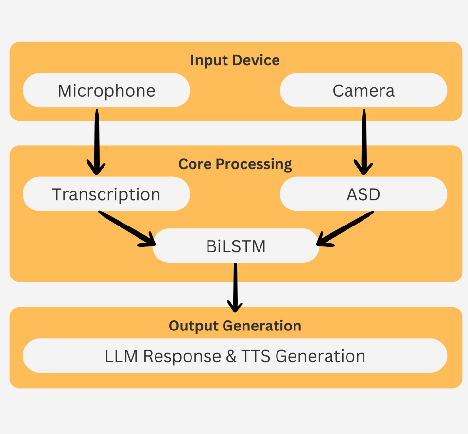

# SpeakSense


**See it in action** ⬇️

[](https://youtu.be/b2W4UdL21sw)



## 🏗️ Project Structure

```
SpeakSense/
├── backend/                    # Python backend services
│   ├── src/
│   │   ├── models/            # ML models (ASD, audio classification)
│   │   ├── services/          # Core services (LLM, transcription)
│   │   ├── api/               # FastAPI endpoints and WebSocket
│   │   └── utils/             # Utility functions
│   ├── tests/                 # Backend tests
│   ├── requirements.txt       # Python dependencies
│   └── setup.py              # Backend setup script
├── frontend/                  # Next.js React frontend
│   ├── app/                   # Next.js app directory
│   ├── public/                # Static assets
│   └── package.json           # Node.js dependencies
├── models/                    # Trained model files and weights
│   ├── trained/               # Trained model checkpoints
│   └── weights/               # Model weight files
├── data/                      # Data files and datasets
│   ├── raw/                   # Raw audio/video data
│   ├── processed/             # Processed features and outputs
│   └── assets/                # Project assets (demos, diagrams)
├── scripts/                   # Utility scripts and tools
├── notebooks/                 # Jupyter notebooks for experiments
├── docs/                      # Documentation and research papers
└── config/                    # Configuration files
```

## 🚀 Quick Start

### Option 1: Automated Setup
```bash
# Set up both backend and frontend
python manage.py --setup

# Start backend server
python manage.py --start-backend

# Start frontend server (in another terminal)
python manage.py --start-frontend
```

### Option 2: Docker Setup
```bash
# Build and run with Docker Compose
python manage.py --docker
```

### Option 3: Manual Setup

#### Backend Setup

1. Navigate to the backend directory:
```bash
cd backend
```

2. Run the setup script:
```bash
python setup.py
```

3. Start the backend server:
```bash
python src/api/fastapi_websocket_server.py
```

#### Frontend Setup

1. Navigate to the frontend directory:
```bash
cd frontend
```

2. Install dependencies:
```bash
npm install
```

3. Start the development server:
```bash
npm run dev
```

### Access the Application
- **Frontend**: http://localhost:3000
- **Backend API**: http://localhost:8000
- **API Documentation**: http://localhost:8000/docs

## 🧠 How It Works

SpeakSense uses a multimodal approach combining:

- **Active Speaker Detection (ASD)**: Identifies who is speaking in video
- **Audio Classification**: Determines if speech is directed at the assistant
- **Visual Analysis**: Analyzes gaze direction and body language
- **Natural Language Processing**: Understands speech intent and context

## 📊 Phase 1: Data Collection & Preparation

### Collect multimodal training data
- Record video, audio, and transcripts of people talking to and around the robot
- Include diverse scenarios (directly addressing robot, talking nearby but not to robot)
- Label data with "addressing robot" vs "not addressing robot" classifications

### Feature extraction pipeline
- Implement the active speaker detection model (Liao et al.)
- Set up basic visual feature extraction (gaze, orientation)
- Configure audio preprocessing pipeline
- Establish transcription service integration

## Phase 2: Initial Model Development

### Build baseline model
- Implement a simple Bidirectional LSTM architecture
- Create input pipelines for each modality
- Design feature fusion mechanism
- Develop training and evaluation scripts

### Basic training and validation
- Train on clear-cut examples first
- Implement cross-validation strategy
- Establish baseline metrics for accuracy, latency, and resource usage

## Phase 3: Model Enhancement

### Improve feature engineering
- Refine visual features (add sustained gaze detection, orientation angles)
- Enhance audio features (directivity, voice characteristics)
- Develop linguistic feature extraction (pronoun detection, imperative forms)

### Architectural improvements
- Add attention mechanisms
- Implement hierarchical structure for modality processing
- Optimize layer configurations

### Advanced training techniques
- Implement curriculum learning
- Add data augmentation for edge cases
- Fine-tune hyperparameters

## Phase 4: System Integration

### Develop real-time processing pipeline
- Create efficient preprocessing modules
- Implement sliding window for contextual memory
- Design adaptive thresholding system

### Optimize for low-end devices
- Quantize model weights
- Implement model pruning
- Profile and optimize critical paths

### Create staged activation system
- Develop always-on lightweight monitoring
- Build trigger mechanism for full model activation
- Implement power management strategies

## Phase 5: Testing & Refinement

### Controlled environment testing
- Measure accuracy metrics in controlled settings
- Benchmark latency and resource usage
- Identify common failure cases

### Real-world testing
- Deploy prototype in various environments
- Collect user feedback on naturalism and responsiveness
- Log false positives and false negatives

### Model refinement
- Retrain with additional edge cases
- Fine-tune confidence thresholds
- Optimize for specific deployment environments

## Phase 6: Deployment & Learning

### Full system deployment
- Integrate with robot's main systems
- Implement logging for continuous improvement
- Develop update mechanism

### Continuous learning
- Add capability to learn from successful interactions
- Implement personalization for specific users
- Create feedback mechanism for misinterpretations
